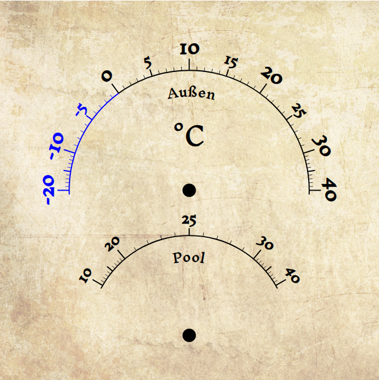

# Ziffernblatt für ein Retro-Thermometer

In dem Projekt verwendet ich snap.svg, um ein Ziffernblatt für eine
Temperaturanzeige im Retro-Look zu erstellen.



Starten mit 

```
npm install
npm serve
```

Und dann im Browser via http://127.0.0.1:3000 öffnen.

